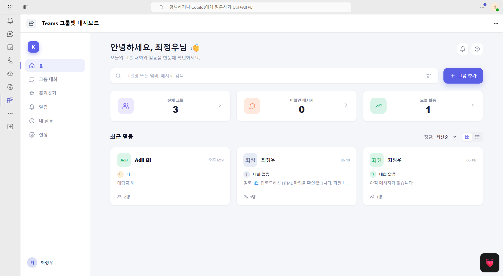

# Teams 그룹챗 대시보드

Teams에서 내가 속한 채팅의 최신 대화를 한 화면에 모아 보는 **SharePoint Framework(SPFx) 웹파트 기반 Teams 개인 탭 앱**입니다.



## 주요 기능

- **Teams 개인 앱**으로 실행되는 대시보드
- 내가 속한 Teams 채팅 목록 조회
- 최근 메시지, 작성자, 시간, 멤버 수를 카드 형태로 표시
- 검색, 정렬, 그리드/리스트 보기 전환
- 즐겨찾기 채팅 관리
- 설정 화면에서 대시보드에 표시할 채팅 선택
- Microsoft Graph Open Extension 기반 사용자 환경설정 저장
- SharePoint/Teams 배포 환경에서는 실제 Graph 데이터 사용
- 로컬/Graph 초기화 실패 시 목업 데이터로 안전 폴백

## 기술 스택

| 항목 | 값 |
| --- | --- |
| Framework | SharePoint Framework 1.23 |
| UI | React 17, SCSS module |
| API | Microsoft Graph |
| 배포 대상 | SharePoint Online App Catalog, Microsoft Teams 조직 앱 |
| 실행 형태 | Teams Personal App, Teams Tab, SharePoint Web Part, SharePoint Full Page |
| Node.js | 22 LTS 권장 |

## 현재 버전

- 앱/웹파트 버전: **1.0.4**
- SharePoint 솔루션 버전: **1.0.4.0**
- Teams 앱 패키지 버전: **1.0.4**

## 폴더 구조

```text
.
├─ config/                         # SPFx 빌드/패키징 설정
├─ docs/images/dashboard.png       # README용 스크린샷
├─ src/webparts/dashboard/
│  ├─ components/                  # React 컴포넌트
│  ├─ models/                      # 데이터 모델
│  ├─ services/                    # Graph/Preferences/Mock 서비스
│  └─ utils/                       # 포맷/아바타 유틸
├─ teams/                          # Teams 앱 아이콘
├─ sharepoint/solution/            # 빌드 후 생성되는 .sppkg/Teams zip 위치
├─ package.json
└─ README.md
```

## 사전 준비

### 1. Node.js

SPFx 1.23은 Node.js 22 LTS 계열을 사용합니다.

```powershell
node -v
```

권장 예:

```text
v22.x
```

### 2. 전역 도구

```powershell
npm install -g gulp-cli yo @microsoft/generator-sharepoint @pnp/cli-microsoft365
```

### 3. Microsoft 365 권한

배포와 권한 승인을 위해 다음 권한이 필요합니다.

- SharePoint App Catalog 관리자 권한
- Microsoft Teams 앱 카탈로그 게시 권한
- Graph API 권한 승인 권한

## 설치

```powershell
npm install
```

## 로컬 빌드

```powershell
gulp build
```

배포용 번들:

```powershell
gulp bundle --ship
gulp package-solution --ship
```

빌드 결과:

```text
sharepoint/solution/teamchatdashboard.sppkg
```

Teams 앱 패키지는 SharePoint App Catalog에 배포한 뒤 생성합니다.

```powershell
m365 spo app teamspackage download `
  --appName "teamchatdashboard.sppkg" `
  --fileName "sharepoint/solution/teamchatdashboard-teams.zip"
```

## SharePoint App Catalog 배포

Microsoft 365 CLI 로그인:

```powershell
m365 login --authType deviceCode
```

SPFx 패키지 업로드:

```powershell
m365 spo app add `
  --filePath "sharepoint/solution/teamchatdashboard.sppkg" `
  --appCatalogScope tenant `
  --overwrite
```

테넌트 전체 배포:

```powershell
m365 spo app deploy `
  --id "<AppCatalogItemId>" `
  --appCatalogScope tenant `
  --skipFeatureDeployment
```

앱 ID 확인:

```powershell
m365 spo app list --appCatalogScope tenant
```

이 프로젝트에서 사용된 솔루션 ID:

```text
c7995bda-69f0-4ae6-a9ab-bc87a3029c9c
```

## Microsoft Graph 권한 승인

이 앱은 다음 Microsoft Graph delegated permission을 요청합니다.

| 권한 | 용도 |
| --- | --- |
| `User.Read` | 현재 사용자 기본 정보 조회 |
| `User.ReadBasic.All` | 채팅 멤버 기본 정보/사진 조회 |
| `Chat.Read` | 내가 참여한 Teams 채팅 및 마지막 메시지 조회 |
| `User.ReadWrite` | 사용자 Open Extension에 환경설정 저장 |

SharePoint Admin Center의 **API access** 화면에서 승인하거나 Microsoft 365 CLI/Graph로 승인합니다.

승인 상태 확인 예:

```powershell
m365 spo serviceprincipal grant list
```

## Teams 앱 게시

SharePoint 앱 카탈로그에서 Teams 패키지를 다운로드합니다.

```powershell
m365 spo app teamspackage download `
  --appName "teamchatdashboard.sppkg" `
  --fileName "sharepoint/solution/teamchatdashboard-teams.zip"
```

조직 Teams 앱 카탈로그에 게시:

```powershell
m365 teams app publish `
  --filePath "sharepoint/solution/teamchatdashboard-teams.zip"
```

기존 앱 업데이트:

```powershell
m365 teams app update `
  --id "<TeamsAppId>" `
  --filePath "sharepoint/solution/teamchatdashboard-teams.zip"
```

특정 사용자에게 개인 앱 설치:

```powershell
m365 teams app install `
  --id "<TeamsAppId>" `
  --userName "<user@tenant.onmicrosoft.com>"
```

## 사용 방법

### 홈

홈 화면에서는 선택된 Teams 채팅의 최신 활동을 카드로 보여줍니다.

- **전체 그룹**: 내가 속한 전체 채팅 수
- **미확인 메시지**: 앱 기준으로 아직 확인하지 않은 대화 수
- **오늘 활동**: 오늘 메시지가 있는 채팅 수
- **최근 활동**: 최신 메시지 순 채팅 카드

### 검색

상단 검색창에서 다음 항목을 검색할 수 있습니다.

- 채팅 이름
- 메시지 작성자
- 메시지 본문 일부
- 멤버 이름

### 정렬

최근 활동 영역에서 정렬 기준을 바꿀 수 있습니다.

- 최신순
- 이름순
- 미확인순

### 보기 전환

우측 보기 버튼으로 다음 모드를 전환합니다.

- 그리드 보기
- 리스트 보기

### 설정

설정 화면에서 채팅별로 다음을 지정합니다.

- 대시보드에 표시할지 여부
- 즐겨찾기 여부

설정값은 Microsoft Graph Open Extension에 저장되어 사용자의 다른 장치에서도 유지됩니다.

## 데이터 저장 방식

사용자별 환경설정은 Microsoft Graph Open Extension에 저장됩니다.

Extension 이름:

```text
com.scout.teamchatdashboard.prefs
```

저장 항목:

- 선택한 채팅 ID 목록
- 즐겨찾기 채팅 ID 목록
- 마지막으로 확인한 채팅 시각
- 정렬 방식
- 보기 방식

## 미확인 메시지 처리 방식

Microsoft Graph는 Teams 채팅별 unread count를 직접 제공하지 않습니다.

이 앱은 다음 방식으로 미확인 상태를 계산합니다.

1. 사용자가 채팅 카드를 열면 `lastViewedAt` 시각을 저장합니다.
2. 마지막 메시지 시각이 `lastViewedAt`보다 최신이면 `NEW` 상태로 표시합니다.
3. 실제 Teams 클라이언트의 읽음 상태와 100% 동일하지 않을 수 있습니다.

## 문제 해결

### 앱이 `[object Object]` 오류를 표시하는 경우

대부분 SPFx component manifest가 예전 버전을 참조할 때 발생합니다.

확인할 것:

- `package.json`의 `version`이 올라갔는지
- `config/package-solution.json`의 `solution.version`이 올라갔는지
- `gulp clean` 후 다시 패키징했는지
- 원격 Client Side Component Manifest가 새 JS 파일을 참조하는지

확인 예:

```powershell
m365 request --method get `
  --url "https://<tenant>.sharepoint.com/sites/appcatalog/_api/web/lists/getbytitle('Client%20Side%20Component%20Manifests')/items" `
  --resource "https://<tenant>.sharepoint.com"
```

### Teams에서 이전 버전이 계속 보이는 경우

- Teams 앱 상세에서 버전을 확인합니다.
- 앱을 제거 후 다시 설치합니다.
- Teams 웹/데스크톱 클라이언트를 새로고침합니다.
- Teams 앱 manifest 버전을 올려 다시 게시합니다.

### Graph 데이터가 나오지 않는 경우

- API access 권한이 승인됐는지 확인합니다.
- `Chat.Read`, `User.Read`, `User.ReadBasic.All`, `User.ReadWrite` 권한이 포함되어야 합니다.
- 권한 승인 후 반영까지 몇 분 걸릴 수 있습니다.

## 개발 메모

이 프로젝트는 SPFx 런타임 안정성을 위해 모든 `@microsoft/sp-*` 패키지를 같은 1.23.0 계열로 맞춥니다.

특히 다음 불일치를 피해야 합니다.

```text
@microsoft/sp-core-library 1.23.0
@microsoft/sp-http         1.23.1
```

이처럼 패키지 버전이 어긋나면 원격 component manifest가 잘못된 SPFx 런타임 버전을 참조할 수 있습니다.

## 라이선스

이 저장소는 별도 라이선스 파일이 추가되기 전까지 내부/개인 학습 및 데모 용도로 사용합니다.
